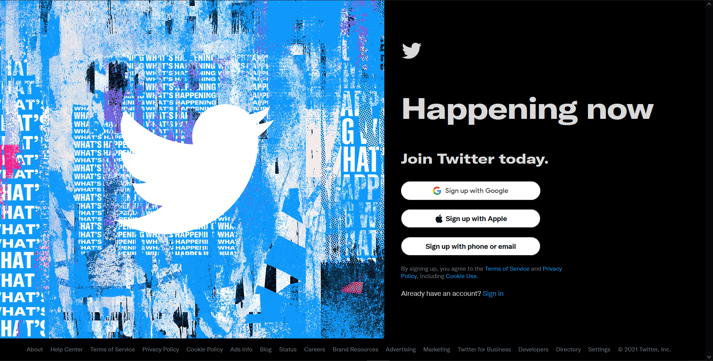
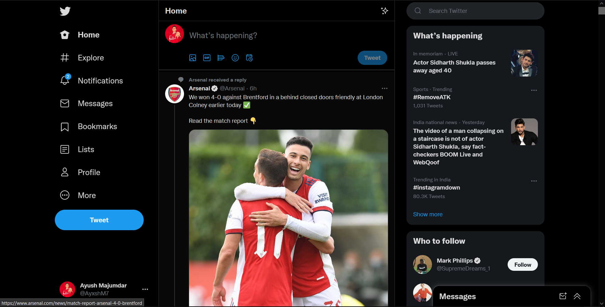
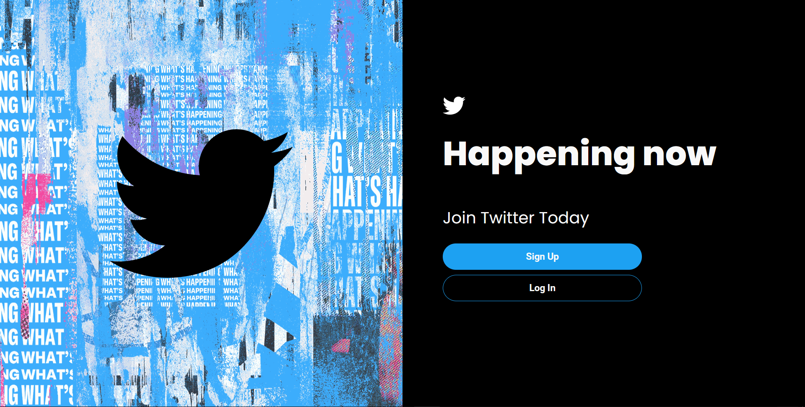
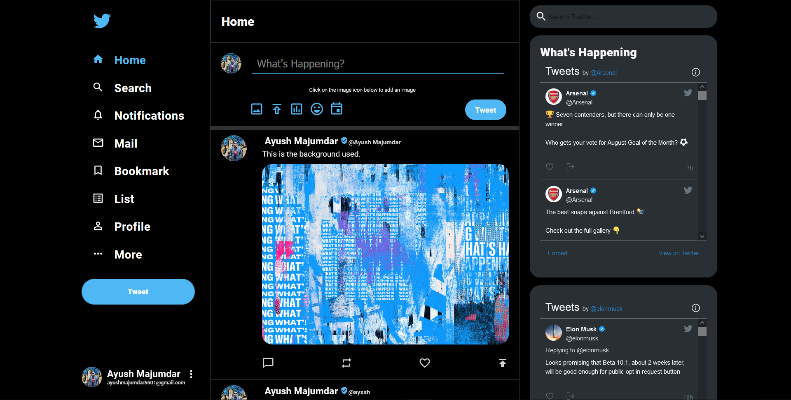

<!-- PROJECT LOGO -->
<br />
<p align="center">
  <a href="https://github.com/Ayush6501/React-Twitter-Clone">
    
  </a>

  <h2 align="center">React Twitter Clone</h2>

  <p align="center">
    A Full Stack Twitter Clone
    <br />
    <a href="https://github.com/Ayush6501/React-Twitter-Clone"><strong>Explore the docs »</strong></a>
    <br />
    <br />
    <a href="https://react-twitter-clone-a6501.firebaseapp.com//">View Demo</a>
    ·
    <a href="https://github.com/Ayush6501/React-Twitter-Clone/issues">Report Bug</a>
    ·
    <a href="https://github.com/Ayush6501/React-Twitter-Clone/issues">Request Feature</a>
  </p>
</p>


<!-- TABLE OF CONTENTS -->
<details open="open">
  <summary><h2 style="display: inline-block">Table of Contents</h2></summary>
  <ol>
    <li>
      <a href="#about-the-project">About The Project</a>
      <ul>
        <li><a href="#built-with">Built With</a></li>
      </ul>
    </li>
    <li>
      <a href="#getting-started">Getting Started</a>
      <ul>
        <li><a href="#prerequisites">Prerequisites</a></li>
        <li><a href="#installation">Installation</a></li>
      </ul>
    </li>
    <li><a href="#screenshots">Screenshots</a></li>
    <li><a href="#inspiration">Inspiration</a></li>
    <li><a href="#license">License</a></li>
    <li><a href="#contact">Contact</a></li>
  </ol>
</details>


<!-- ABOUT THE PROJECT -->
## About The Project

This is a full-stack clone of Twitter. A User can authenticate themselves using their google credentials and post pictures or tweets
and can see it dynamically appearing on the timeline in real time. This web application is completely mobile responsive and works
like a breeze irrespective of your device. Hoping to see your posts on the timeline soon!

### Built With

* React
* React Router
* Firebase
* Styled Components
* Material UI


<!-- GETTING STARTED -->
## Getting Started

To get a local copy up and running follow these simple steps.

### Prerequisites

This is an example of how to list things you need to use the software and how to install them.
* npm
  ```sh
  npm install npm@latest -g
  ```

### Installation

1. Clone the repo
   ```sh
   git clone https://github.com/Ayush6501/react-disneyplus-clone.git
   ```
2. Install NPM packages
   ```sh
   npm install
   ```


<!-- SC EXAMPLES -->
## Screenshots

1. The Real Twitter Page


2. Twitter Clone 




<!-- Inspiration -->
## Inspiration

The Original site can be found at <a href="https://twitter.com/">Here</a>.


<!-- CONTRIBUTING -->
## Contributing

Contributions are what make the open source community such an amazing place to learn, inspire, and create. Any contributions you make are **greatly appreciated**.

1. Fork the Project
2. Create your Feature Branch (`git checkout -b feature/AmazingFeature`)
3. Commit your Changes (`git commit -m 'Add some AmazingFeature'`)
4. Push to the Branch (`git push origin feature/AmazingFeature`)
5. Open a Pull Request


<!-- LICENSE -->
## License

Distributed under the MIT License. See `LICENSE` for more information.


<!-- CONTACT -->
## Contact

Ayush Majumdar - [@email](ayushmajumdar6501@gmail.com)

Project Link: https://github.com/Ayush6501/React-Twitter-Clone

Website Link: https://react-twitter-clone-a6501.firebaseapp.com/
